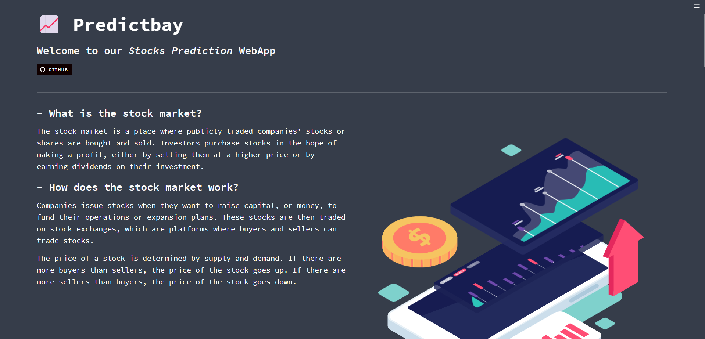
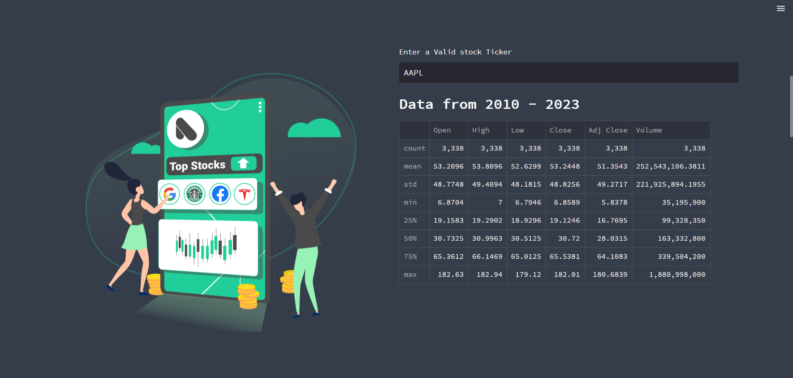
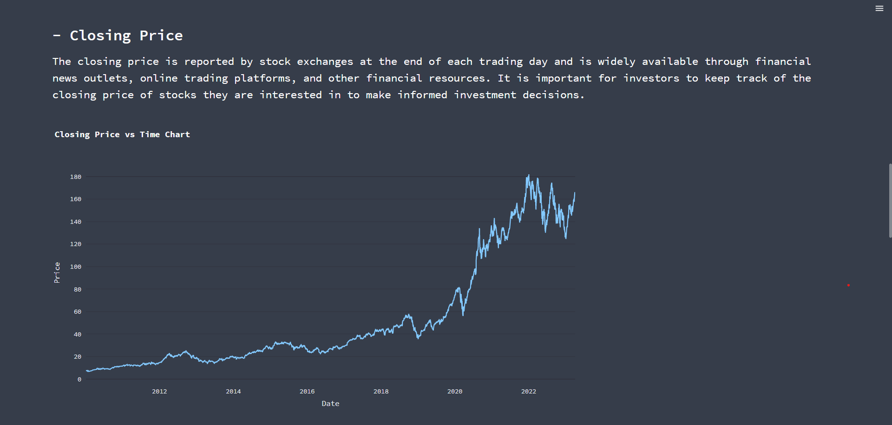
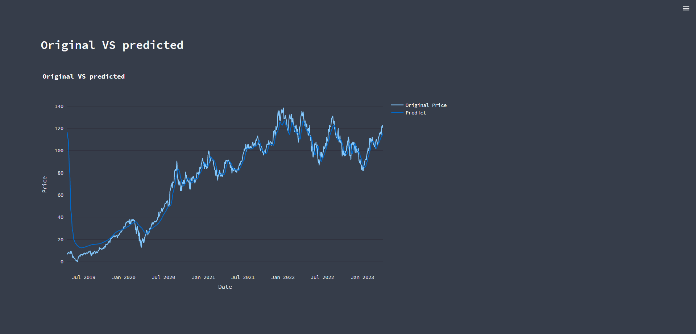

<h1 align="center">Predictbay</h1>

<a href="https://predictbay-deployment-gfg-dfdw6l7waq-el.a.run.app/"></a>


### Problem Statement :
The stock market is volatile and unpredictable, making it difficult for investors to make informed decisions about when to buy or sell their investments. There is a need for a real-time stock market predictor that can help investors make better decisions by predicting future stock prices accurately.

### Solution Description :
We propose to build a real-time stock market predictor using machine learning. The system will collect real-time and historical stock market data from different industries and preprocess the data to remove outliers and missing values. We will then use feature engineering techniques to select the most relevant features that can affect the stock market's performance.

We will train a Deep learning model such as LSTM on the preprocessed data to predict future stock prices accurately. The model will be loaded in the Streamlit app using different modules/Libraries to generate real-time predictions. The app will display interactive charts and graphs that can show the predicted stock prices in real-time.

To ensure that the model is accurate and reliable, we will use cross-validation techniques and evaluate the model's performance using metrics such as Mean Squared Error (MSE), Root Mean Squared Error (RMSE), and Mean Absolute Error (MAE). We will also test the model on a separate test set to ensure that it can generalize well to new data.

Overall, our real-time stock market predictor will provide investors with a reliable tool that can help them make better-informed decisions about when to buy or sell their investments. By predicting future stock prices accurately, the system can help investors avoid losses and maximize their profits.

----

<h3>A list of the required modules used in the code and the command to install them using pip:</h3>

```
pip install numpy
pip install pandas
pip install yfinance
pip install streamlit
pip install pandas-datareader
pip install scikit-learn
pip install tensorflow
pip install plotly
pip install requests
pip install streamlit-lottie
pip install datetime
```






<h2>Future Prediction :</h2>

```
from keras.models import load_model
model = load_model('keras_model.h5')
last_100_days = data_testing[-100:].values
last_100_days_scaled = scaler.transform(last_100_days)
predicted_prices = []
for i in range(1):
    X_test = np.array([last_100_days_scaled])
    X_test = np.reshape(X_test, (X_test.shape[0], X_test.shape[1], 1))
    predicted_price = model.predict(X_test)
    predicted_prices.append(predicted_price)
    last_100_days_scaled = np.append(last_100_days_scaled, predicted_price)
    last_100_days_scaled = np.delete(last_100_days_scaled, 0)
predicted_prices = np.array(predicted_prices)
predicted_prices = predicted_prices.reshape(predicted_prices.shape[0],predicted_prices.shape[2])
predicted_prices = scaler.inverse_transform(predicted_prices)
print('Predicted price for the next day:', predicted_prices[0][0])
```
<p><i>This code block is loading a trained Keras model, using it to make predictions on the next day's stock price based on the last 100 days of historical data, and then printing out the predicted price</i>

The `load_model` function from Keras is used to load the trained model from a saved file named `keras_model.h5`.

The next step is to get the last 100 days of historical data from the testing dataset and scale the data using the `scaler.transform` function. The scaler was previously fit to the training dataset and is used to normalize the testing data.

An empty list called `predicted_prices` is created to store the predicted prices. The for loop iterates only once and creates an array `X_test` containing the last 100 days of scaled data. The array `X_test` is then reshaped to match the input shape of the trained model, which is `(number of samples, number of timesteps, number of features)`. In this case, there is only one feature (the stock price), so the input shape is `(1, 100, 1)`.

The `model.predict` function is used to generate a prediction for the next day's stock price based on the 100 days of historical data. The predicted price is then appended to the `predicted_prices` list, and the oldest data point in `last_100_days_scaled` is replaced with the predicted price. This updated list is then used in the next iteration of the loop to generate a prediction for the following day.

Once the loop is finished, the predicted prices are inverted back to their original scale using the `scaler.inverse_transform` function. The predicted price for the next day is then printed to the console using `print('Predicted price for the next day:', predicted_prices[0][0])`.

</p>
